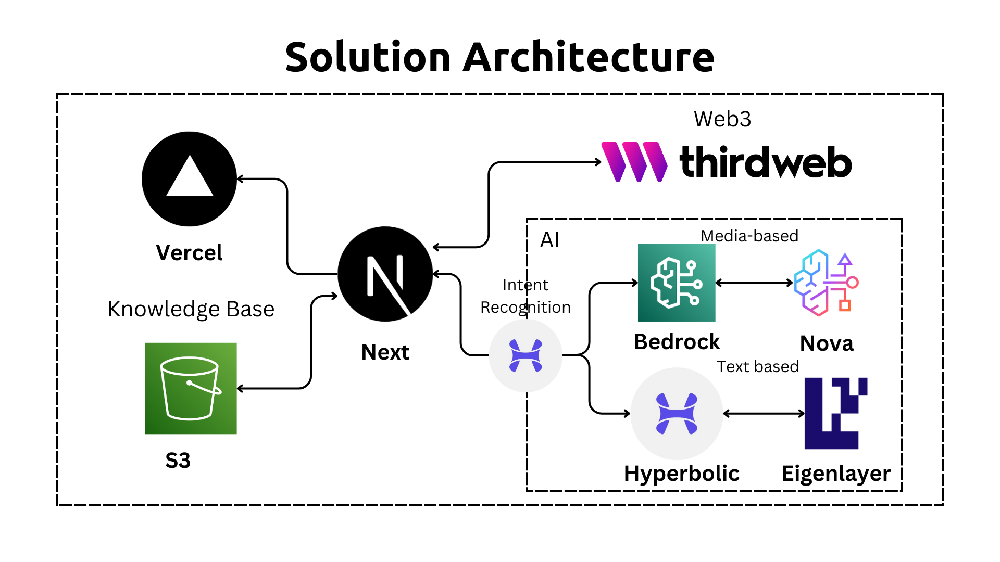

# MemesDreams - AI NFT/Token Character Generation & Social Media Platform

Create, manage, and share AI-generated characters with integrated social media features. MemesDreams leverages AWS Bedrock AI to generate unique characters and enables sharing through Twitter integration.



## Features

- AI Character Generation using AWS Bedrock
- Social Media Content Management
- Secure Character Storage on AWS S3
- Web3 Smart Contract Integration
- Twitter API Integration
- Interactive AI Chat Assistant
- Character NFT Minting

## Tech Stack

- Next.js 14 with App Router
- AWS Services (Bedrock, S3)
- TailwindCSS
- Web3.js/Ethers.js
- Hyperbolic AI SDK

## Deployment
## Deployment

1. Clone repository
2. Install dependencies: `npm install` 
3. Configure environment variables

### AWS Setup

1. Create IAM User:
```bash
aws iam create-user --user-name memesdreams-app
aws iam attach-user-policy --user-name memesdreams-app --policy-arn arn:aws:iam::aws:policy/AWSBedrockFullAccess
aws iam attach-user-policy --user-name memesdreams-app --policy-arn arn:aws:iam::aws:policy/AmazonS3FullAccess
aws iam attach-user-policy --user-name memesdreams-app --policy-arn arn:aws:iam::aws:policy/AWSLambdaFullAccess
```

2. Configure Knowledge Base:
```bash
# Create S3 bucket for knowledge base
aws s3 mb s3://memesdreams-kb

# Upload training data
aws s3 cp ./data s3://memesdreams-kb/data --recursive
```

3. Setup Bedrock Model:
```bash
# Create model configuration
aws bedrock create-model --model-id memesdreams-model \
    --model-name "MemesDreams Character Generator" \
    --data-source s3://memesdreams-kb/data
```

4. Deploy to Vercel: 
```bash
vercel deploy
```

## Local Development

### Prerequisites

- Node.js 18+
- AWS Account credentials
- Twitter Developer API keys
- Ethereum wallet

### Environment Setup

Copy `.env.example` to `.env`:
```env
# Environment variables must be configured
# See .env.example for required fields
```

### Running Locally

```bash
npm run dev
```

Access the application at `http://localhost:3000`

## API Routes

### Character Generation
- `POST /api/generate`: Generate new AI character
- `GET /api/characters`: List all characters
- `GET /api/characters/{id}`: Get specific character

### Social Media
- `POST /api/twitter/post`: Share character on Twitter
- `GET /api/twitter/metrics`: Get engagement metrics

### Web3
- `POST /api/mint`: Mint character as NFT
- `GET /api/tokens`: Get user's NFT collection